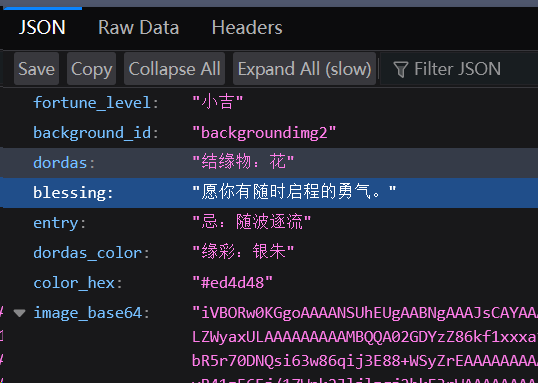

# 祈福签 API - Python 版本

基于 FastAPI + Pillow 实现的sky祈福签图片生成 API

## 技术栈

| 包 | 版本 | 说明 |
|:---|:---|:---|
| [](https://python.org/) | 3.12+ | 编程语言 |
| [](https://fastapi.tiangolo.com/) | 0.123.9 | Web 框架 |
| [](https://python-pillow.org/) | 12.0.0 | 图像处理 |
| [](https://www.uvicorn.org/) | 0.38.0 | ASGI 服务器 |
| [](https://github.com/uiri/toml) | 0.10.2 | 配置文件解析 |

## 效果预览

### 图片效果


### JSON效果


## 快速开始

### 1. 安装依赖

```powershell
# 推荐使用uv，开发的时候使用3.12 3.13
# https://gitee.com/wangnov/uv-custom/releases
python --version

# 创建虚拟环境
uv venv

# (可选)激活虚拟环境 并打印一下解释器路径
.\venv\Scripts\activate  # Windows
Get-Command python # Windows PowerShell
source venv/bin/activate  # Linux/macOS
which python # Linux bash

# 安装依赖
uv pip install -r ./requirements.txt
```

### 2. 配置文件

编辑 `config.toml`:

```toml
[server]
host = "0.0.0.0"
port = 51205
log_level = "debug"  # "info" 或 "debug"

[image]
width = 1240
height = 620
font_size = 40
assets_dir = "../assets"
```

### 3. 运行服务

```powershell
cd src
uv run python main.py
```

或使用 uvicorn 直接运行：

```powershell
cd src
uv uvicorn main:app --host 0.0.0.0 --port 51205
# --reload可选
uv uvicorn main:app --host 0.0.0.0 --port 51205 --reload
```

### 4. 访问 API

- **主页**: http://localhost:51205/
- **获取祈福签**: http://localhost:51205/blessing
- **API 文档**: http://localhost:51205/docs

## 项目结构

```
skyblessings-fastapi-pillow/
├── assets/              # 资源文件
│   ├── font/           # 字体文件
│   │   └── LXGWWenKaiMono-Medium.ttf
│   └── image/          # 图片资源
│       ├── background.png       # 遮罩图
│       ├── background0-5.png    # 装饰背景
│       └── text0-4.png          # 签文图片
├── src/                # 源代码
│   ├── main.py         # FastAPI 主应用
│   ├── render.py       # 图片渲染逻辑
│   └── draw_data.py    # 祝福数据
├── venv/               # Python 虚拟环境
├── config.toml         # 配置文件
└── README.md           # 说明文档
```

## API 端点

### GET /

返回 API 信息

**响应示例**:
```json
{
  "name": "祈福签 API",
  "version": "1.0.0",
  "endpoints": {
    "/": "API 信息",
    "/blessing": "获取随机祈福签图片（PNG）"
  }
}
```

### GET /blessing

生成并返回祈福签

**查询参数**:

| 参数 | 类型 | 默认值 | 说明 |
|------|------|--------|------|
| `type` | string | `image` | 返回格式（可选），见下方说明 |
| `a` | string | - | 种子参数 a（可选） |
| `b` | string | - | 种子参数 b（可选） |
| `c` | string | - | 种子参数 c（可选） |
| `d` | string | - | 种子参数 d（可选） |
| `e` | string | - | 种子参数 e（可选），都见下方说明 |

**?type= 说明**:

- `image`（默认）：直接返回 PNG 图片（`image/png`）
- `json`：返回 JSON 数据，包含签文信息 + `image_base64` 字段（base64 编码的 PNG）
- `json_without_image`：返回 JSON 数据，不含图片

**?a= ~ ?e= 种子参数说明**:

这 5 个参数用于固定抽签结果。传入任意一个或多个参数后，服务会将它们拼接后做 MD5 哈希作为随机种子，相同的参数组合每次都会得到相同的签文。

典型用法：传入用户 ID（如 QQ 号）+ 日期，实现"每日一签"效果——同一用户同一天抽到的签相同，不同用户或不同天则不同。

不传任何种子参数时，每次请求随机生成。

**`type=json` 响应示例**:
```json
{
  "fortune_level": 2,
  "background_id": 1,
  "dordas": "飞鸟",
  "blessing": "互相在意的人，不会走散。",
  "entry": "不思进取",
  "dordas_color": "蔚蓝",
  "color_hex": "#28d1e9",
  "image_base64": "iVBORw0KGgo..."
}
```

**调试输出**（log_level=debug 时）:
```
--- 抽签结果 (Debug) ---
背景图: background1.png
签文图: text0.png
结缘物：飞鸟
缘彩：蔚蓝 (#28d1e9)
祝福语: 互相在意的人，不会走散。
忌：不思进取
--------------------------
```

## curl指令 示例

```bash
# 获取随机祈福签图片，保存为 blessing.png
curl -o blessing.png "http://localhost:51205/blessing"

# 获取 JSON 数据（含 base64 图片）
curl "http://localhost:51205/blessing?type=json"

# 获取 JSON 数据（不含图片）
curl "http://localhost:51205/blessing?type=json_without_image"

# 固定种子：传入用户ID + 日期，实现每日一签
curl -o blessing.png "http://localhost:51205/blessing?a=123456789&b=2026-04-08"

# 固定种子 + 返回 JSON
curl "http://localhost:51205/blessing?type=json&a=123456789&b=2026-04-08"
```

## 配置说明

### [server]

- `host`: 监听地址（默认 `0.0.0.0`）
- `port`: 监听端口（默认 `51205`）
- `log_level`: 日志级别（`info` 或 `debug`）

### [image]

- `width`: 图片宽度（默认 `1240`）
- `height`: 图片高度（默认 `620`）
- `font_size`: 字体大小（默认 `40`）
- `assets_dir`: 资源文件夹路径

## 性能

- **响应时间**: 约 50-150ms
- **内存占用**: 约 100-200MB
- **并发支持**: FastAPI 异步处理

## 故障排查

### 字体加载失败

如果提示字体加载失败，检查：
1. `assets/font/LXGWWenKaiMono-Medium.ttf` 文件是否存在
2. `config.toml` 中 `assets_dir` 路径是否正确

### 图片渲染错误

如果生成的图片颜色不对：
1. 检查 `assets/image/` 目录下所有 PNG 文件是否完整
2. 查看日志中的错误信息

### 端口被占用

修改 `config.toml` 中的 `port` 值，或停止占用端口的进程：

```powershell
# 查找占用端口的进程
netstat -ano | findstr :51205 # Windows PowerShell
sudo lsof -i :51205 # Linux bash

# 结束进程
taskkill /PID <进程ID> /F # Windows PowerShell
sudo kill -9 <进程ID> # Linux bash
```

